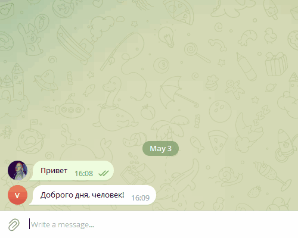

# verbs_games_support_bot
Бот поддержки компании "Verbs games". Отвечает на вопросы по разделам:
- Приветствие
- Вопросы от действующих партнёров
- Вопросы от забаненных
- Забыл пароль
- Удаление аккаунта
- Устройство на работу

Если интент не распознан, ответ не последует. 

## Установка
[Установите Python](https://www.python.org/), если этого ещё не сделали. Требуется Python 3.8 и старше. Код может запуститься на других версиях питона от 3.1 и старше, но на них не тестировался.

Проверьте, что `python` установлен и корректно настроен. Запустите его в командной строке:
```sh
python --version
```
Возможно, вместо команды `python` здесь и в остальных инструкциях этого README придётся использовать `python3`. Зависит это от операционной системы и от того, установлен ли у вас Python старой второй версии. 

Скачайте код:
```sh
git clone https://github.com/MelnikovEI/verbs_games_support_bot.git
```

Перейдите в каталог проекта:
```sh
cd verbs_games_support_bot
```

В каталоге проекта создайте виртуальное окружение:
```sh
python -m venv venv
```
Активируйте его. На разных операционных системах это делается разными командами:

- Windows: `.\venv\Scripts\activate`
- MacOS/Linux: `source venv/bin/activate`

Установите зависимости в виртуальное окружение:
```sh
pip install -r requirements.txt
```

Определите переменные окружения. Создайте файл `.env` в каталоге `verbs_games_support_bot/` и положите туда такой код:
```sh
TG_BOT_TOKEN=5969...:AAHo95396...qWokHo
GOOGLE_APPLICATION_CREDENTIALS=C:\Users\...\AppData\Roaming\gcloud\application_default_credentials.json
GOOGLE_CLOUD_PROJECT=verbs-games-support2-vyfg
VK_GROUP_TOKEN=vk1.a.r...5dUHYg
TG_ADMIN_BOT_TOKEN=613...yd5Q
ADMIN_CHAT_ID=54...70
```
Данные выше приведены для примера.
- `TG_BOT_TOKEN` замените на токен он чатбота в Telegram. Вот [туториал](https://spark.ru/startup/it-agenstvo-index/blog/47364/kak-poluchit-tokeni-dlya-sozdaniya-chat-bota-v-telegrame-vajbere-i-v-vkontakte), как это сделать.
- `GOOGLE_APPLICATION_CREDENTIALS` задаёт путь к файлу с ключами от вашего Google-аккаунта
- `VK_GROUP_TOKEN` замените на токен от группы VK. Вот [туториал](https://spark.ru/startup/it-agenstvo-index/blog/47364/kak-poluchit-tokeni-dlya-sozdaniya-chat-bota-v-telegrame-vajbere-i-v-vkontakte), как это сделать.
- `TG_ADMIN_BOT_TOKEN` токен бота для администрирования проекта, пришлёт ошибку скрипта администратору
- `ADMIN_CHAT_ID` id учетной записи администратора в телеграм можно узнать https://telegram.me/userinfobot
## Запуск
Телеграм бот
```sh
python tg_bot.py
```
VK бот
```sh
python tg_bot.py
```
Скрипт будет работать до тех пор, пока не будет закрыт.

Пример работы:

